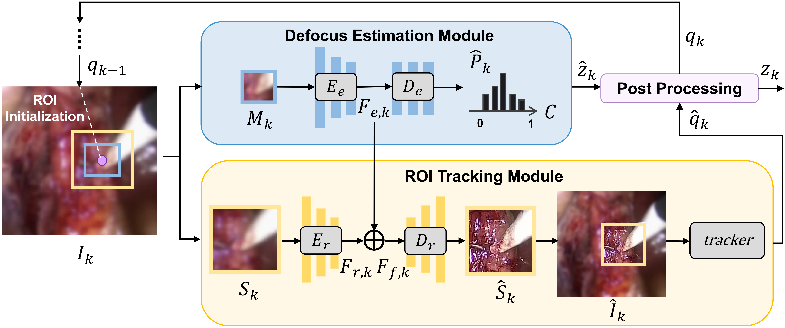

# 3D Tracking Framework
[TMECH2025] This is the official repository of "Autofocusing with Three-Dimensional Tracking for Robot-Assisted Microsurgery"

**1 Environment Setup**

To run this repository, ensure your Python environment includes the following packages:
    
    torch 
    torchvision
    opencv
    pillow
    tqdm
    numpy

**2 Dataset**

The dataset structure is shared for both defocus estimation and virtual refocusing. If the number of defocus levels is N, organize the dataset as follows:

    dataset
        |—— train
            |—— 00
                |—— xxx.png
                |—— yyy.png
                |—— zzz.png
            |—— 01
            |—— 02
            |—— ..
            |—— N-1
        |—— val
        |—— test

*Note that each image should have equal height and width, which are the multiples of 64 (e.g., 64 * 64, 128 * 128, etc.).*

**3 Example Code**

step 1 : train and evaluate the defocus estimation model
        
    cd ./defocusEstimation
    python3 train.py --dataroot "../dataset" --class_num N --results_dir "./result" --save "exp1"
    python3 test.py --test_dir "../dataset/test" --class_num N --resume "./result/exp1/(checkpoint to test).pth.tar"
*(Replace N with the number of defocus levels.)*

step 2 : train and evaluate the virtual refocusing model
    
    cd ./virtualRefocusing
    python3 train.py --dataroot "../dataset" --pre-trained "../defocusEstimation/result/exp1/(checkpoint to use).pth.tar" --class_num N --results-dir "./result" --save "exp1"
    python3 test.py --test_dir "../dataset/test" --pre_trained "../defocusEstimation/result/exp1/(checkpoint to use).pth.tar" --class_num N --resume "./result/exp1/(checkpoint to test).pth"
*(Replace N with the number of defocus levels.)*

step 3 : integrate into the 3D tracking framework

The trained defocus estimation and virtual refocusing models can be integrated into your autofocusing system as shown below.

